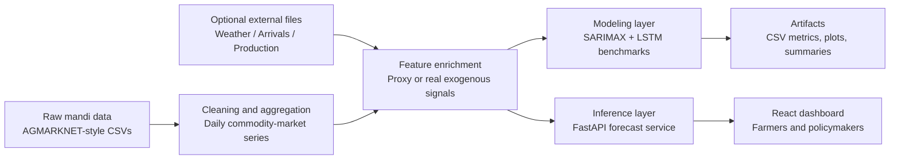

# FarmSense

FarmSense is an AI/ML commodity-price intelligence system for agri-horticultural markets. It helps farmers and policymakers understand recent mandi behavior, compare markets, and forecast short-term price windows using historical price data plus weather, arrivals, and production-side features.

## Problem Statement

Farmers often decide when to sell with limited visibility into future mandi prices. That creates avoidable post-harvest losses, while policymakers also struggle to spot supply shocks early enough to stabilize markets.

FarmSense addresses that gap by combining:

- cleaned mandi price history
- external-feature support for weather, arrivals, and production
- benchmark time-series models
- a farmer-friendly dashboard for decision support

## What Is Working Now

- FastAPI backend with live forecast endpoints
- React dashboard with commodity/market selection and price-forecast panels
- feature engineering pipeline for weather, arrivals, and production signals
- SARIMAX and LSTM benchmark training workflow
- benchmark artifacts, CSV outputs, and forecast plots for submission/demo use

## System Overview



## Feature Engineering

The ML pipeline now adds three groups of features on top of price history:

1. Weather features
   - `rainfall_mm`
   - `temperature_c`
   - `humidity_pct`
   - `weather_shock_index`

2. Arrivals features
   - `series_daily_records`
   - `market_total_activity`
   - `state_commodity_activity`
   - `arrival_pressure_index`
   - `market_activity_ratio`

3. Production-side features
   - `monthly_supply_index`
   - `harvest_window_flag`
   - `production_pressure_index`

If real external CSVs are not available, the pipeline still runs by generating:

- state-zone weather proxies from month and climate band
- arrival pressure from market activity in the price dataset
- production pressure from historical commodity-state monthly supply patterns

Schema notes for real external files are documented in `dataset/external/README.md`.

## Modeling Pipeline

FarmSense now supports two benchmark model families under `ml/`:

- `SARIMAX` for interpretable time-series forecasting with exogenous features
- `LSTM` for sequence modeling over historical price plus exogenous signals

The benchmark script:

- selects benchmark-ready mandi series
- trains both models
- evaluates on a holdout window
- writes metrics and future-forecast CSVs
- saves comparison plots for demo/submission use

## Benchmark Snapshot

Artifacts were generated with:

```bash
python ml/train_benchmarks.py --top-series 3 --test-size 14 --future-horizon 14 --output-dir artifacts/benchmarks
python ml/train_benchmarks.py --commodity Potato --market Pehowa --state Haryana --test-size 14 --future-horizon 14 --output-dir artifacts/case_study_pehowa
```

### Automatic benchmark set

From `artifacts/benchmarks/benchmark_metrics.csv`:

| Series | Model | MAE | RMSE | MAPE |
|---|---:|---:|---:|---:|
| Potato - Kalipur, West Bengal | Naive | 37.14 | 44.72 | 2.89 |
| Potato - Kalipur, West Bengal | SARIMAX | 72.38 | 83.05 | 5.61 |
| Potato - Kalipur, West Bengal | LSTM | 687.89 | 690.41 | 52.90 |
| Onion - Kalipur, West Bengal | Naive | 57.14 | 75.59 | 4.40 |
| Onion - Kalipur, West Bengal | SARIMAX | 360.95 | 416.01 | 27.40 |
| Onion - Kalipur, West Bengal | LSTM | 1501.18 | 1536.04 | 112.75 |
| Wheat - Bishnupur(Bankura), West Bengal | Naive | 0.00 | 0.00 | 0.00 |
| Wheat - Bishnupur(Bankura), West Bengal | SARIMAX | 7.84 | 9.10 | 0.26 |
| Wheat - Bishnupur(Bankura), West Bengal | LSTM | 205.44 | 205.45 | 6.85 |

Interpretation:

- stable series are still difficult to beat with sophisticated models
- SARIMAX is currently the most reliable of the two benchmark families
- LSTM needs richer real exogenous data and more tuning to generalize consistently

### Volatile-market case study

From `artifacts/case_study_pehowa/benchmark_summary.json`:

| Series | Model | MAE | RMSE | MAPE |
|---|---:|---:|---:|---:|
| Potato - Pehowa, Haryana | Naive | 125.00 | 158.68 | 12.84 |
| Potato - Pehowa, Haryana | SARIMAX | 280.51 | 350.37 | 28.81 |
| Potato - Pehowa, Haryana | LSTM | 94.21 | 116.39 | 10.64 |

This case study is useful in a demo because it shows the feature-rich LSTM helping on a more volatile potato market, even though the aggregate benchmark still favors SARIMAX on steadier series.

## Project Structure

```text
FarmSense/
|- backend/
|  |- app/
|  |  |- routes/
|  |  |- services/
|  |- main.py
|  |- requirements.txt
|- frontend/my-app/
|  |- src/
|  |  |- lib/
|  |  |- pages/
|- ml/
|  |- feature_pipeline.py
|  |- train_benchmarks.py
|  |- requirements.txt
|- dataset/
|  |- processed/
|  |- external/
|- artifacts/
|  |- benchmarks/
|  |- case_study_pehowa/
|- docs/
|  |- architecture.md
|  |- demo-script.md
```

## Quick Start

### 1. Backend API

```bash
cd backend
python -m pip install -r requirements.txt
uvicorn main:app --reload
```

### 2. Frontend dashboard

```bash
cd frontend/my-app
cmd /c npm install
cmd /c npm run dev
```

### 3. ML benchmark environment

```bash
cd ml
python -m pip install --user -r requirements.txt
cd ..
python ml/train_benchmarks.py --top-series 3 --test-size 14 --future-horizon 14 --output-dir artifacts/benchmarks
```

### 4. Optional external data

Drop real files into `dataset/external/` using the schemas described in `dataset/external/README.md`.

## API Endpoints

The backend currently exposes:

- `GET /api/forecast/options`
- `GET /api/forecast/markets?commodity=<name>`
- `GET /api/forecast/summary?commodity=<name>&market=<name>&state=<name>&horizon_days=<n>`
- `GET /api/forecast/comparison?commodity=<name>`

## Submission Assets

- Architecture: `docs/architecture.md`
- Demo narrative: `docs/demo-script.md`
- Benchmark summary: `artifacts/benchmarks/benchmark_summary.json`
- Volatile-market case study: `artifacts/case_study_pehowa/benchmark_summary.json`

## Honest Limitations

- The current benchmark uses proxy weather/arrival/production signals unless real external CSVs are provided.
- SARIMAX sometimes emits convergence warnings on noisy series, but the pipeline still completes and saves outputs.
- LSTM performance is sensitive to series selection and is not yet consistently better than naive baselines.
- The next major quality jump will come from plugging in real historical weather, official arrival tonnage, and production estimates.

## Next Best Improvements

- ingest real IMD/weather API history instead of climate proxies
- plug in official mandi arrival tonnage files
- add district/state production estimates from agricultural reports
- benchmark TFT/XGBoost/Temporal Fusion models after exogenous data quality improves

