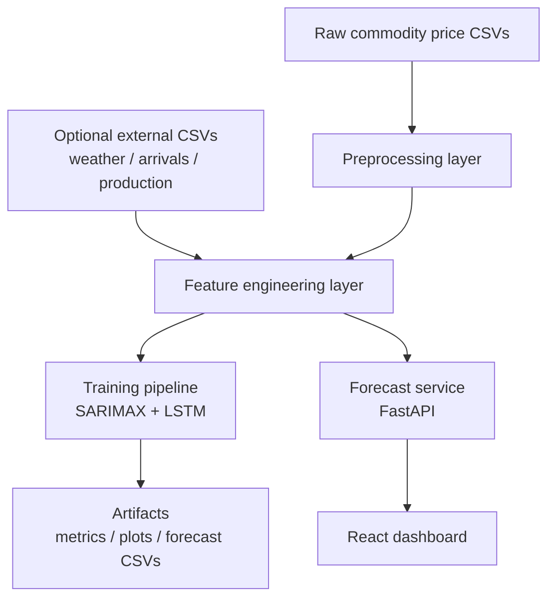

# FarmSense Architecture

## High-Level Design

## Layer Breakdown

### 1. Data Layer

Inputs:

- `dataset/Mandi.csv`
- `dataset/agmarknet.csv`
- `dataset/processed/farmsense_clean_dataset.csv`
- optional external files under `dataset/external/`

Outputs:

- cleaned daily commodity-market price series
- enriched features for weather, arrivals, and production signals

### 2. Feature Engineering Layer

Implemented in `ml/feature_pipeline.py`.

Responsibilities:

- aggregate raw price rows into daily commodity-market-state series
- add market activity and arrival pressure features
- add monthly supply and harvest-window features
- merge real weather features if present
- otherwise generate climate-zone weather proxies
- create future exogenous frames for model forecasting

### 3. Modeling Layer

Implemented in `ml/train_benchmarks.py`.

Responsibilities:

- select benchmark-ready mandi series
- train and evaluate SARIMAX with exogenous inputs
- train and evaluate LSTM with exogenous inputs
- compare against a naive carry-forward baseline
- save CSV metrics, holdout forecasts, future forecasts, and PNG plots

### 4. Serving Layer

Implemented in `backend/app/services/forecast_service.py` and `backend/app/routes/forecast_routes.py`.

Responsibilities:

- expose commodity and market options
- return dashboard-ready forecast summaries
- provide mandi comparison payloads
- support frontend consumption through JSON APIs

### 5. Experience Layer

Implemented in `frontend/my-app/src/pages/Dashboard.jsx`.

Responsibilities:

- allow commodity and market selection
- render current price, forecast range, and recommendation cards
- show price trajectory and model confidence indicators
- compare multiple markets for the same commodity

## Current Modeling Reality

The training stack is intentionally honest:

- SARIMAX is the stronger default benchmark today
- LSTM is included because it is part of the target problem direction
- with proxy exogenous inputs, LSTM helps on some volatile markets but is not yet consistently superior

That is still valuable for a hackathon/demo because it shows:

1. the project already supports richer external features
2. the system can benchmark multiple model families
3. there is a clear path from MVP to stronger production-grade forecasting

## Recommended Next Architecture Step

The highest-impact upgrade is replacing proxy exogenous features with real historical datasets:

- state or district weather history
- official mandi arrivals
- crop production / acreage / yield estimates

Once those feeds exist, the same feature pipeline can be reused with stronger model families such as gradient boosting, TFT, or sequence-to-sequence transformers.
